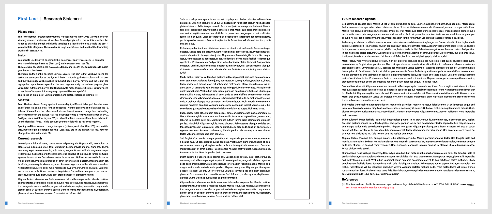

# template-research-statement

This is the format I created for my faculty job applications in the 2023-24 cycle. You can view my research statement at this link (https://www.fmyang.com/files/statements/Fumeng_Yang-RS_2023.pdf). Several people asked me for this template. I'm happy to share it although I think this template is a little hard to use. :-) It is the best when you need lots of figures. The main file is `template-RS.tex`, and most of the formatting stuff is in `format.tex`.

## Basics

You need to use XeLaTeX to compile this document. On overleaf, `menu` → `compiler`. You should change the name (First Last) in the `template-RS.tex` file.

The colors are specified in the `format.tex` file, around line 69. The convention is to match your home school color.

The figure on the right is specified using `minipage`. The pain is that you have to end the text in the same position as the figure. If the text is too long, the text column will run over and the whole page will be pushed to the next page. So you have to end the text at the right point, or put the extra part into the next page manually. Sometimes `\vspace` gives you a bit of extra room. Sorry, I don't know how to make this more flexible. You may need to use lots of `\vspace`. P.S. using `wrapfigure` will be more painful.

## Advanced

**Font** The fonts I used for my applications are slightly different. I changed them because one of them is a commercial font, and because I want to preserve a bit of uniqueness for myself :-). I chose different fonts, but I also think these fonts are decent. You can change them by loading different `ttf` files in the format.tex file. I suggest to use a font which matches your CV. So if you use a serif font in your CV, you should at least use a serif font here. I chose to use the identical fonts. This is because your materials will be reviewed together.

**Spacing and Size** You can change line space (`\linespread`, about line 185), section title size, page margin, paragraph spacing (`\parskip`) etc in the `format.tex` file. You can change font size in the main file.
